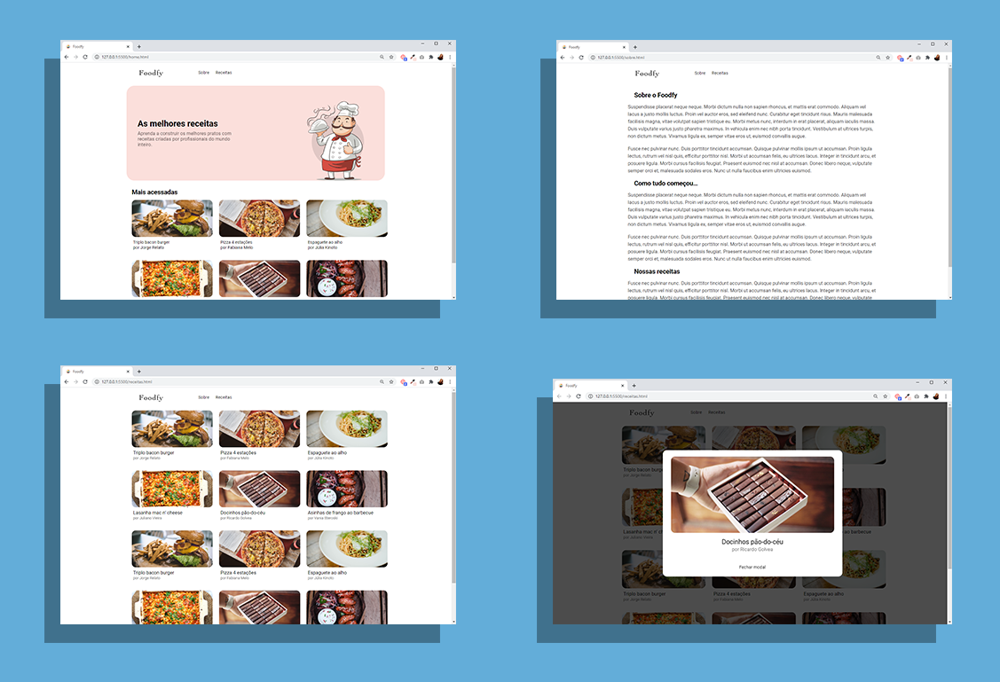

<h1 align = center style = "color: ##F8DBDB">
    Foodfy
</h1>

# Foodfy

<h1 align = center; style = "box-shadow: 10px 5px 5px black">
    
</h1>

## Páginas 

O site é composto por 3 páginas: 
- **Home:**
- **Sobre:**
- **Receitas:**

<h1 align = center>
    
</h1>

## Tecnologias utilizadas

- HTML
- CSS
- JavaScript

---
